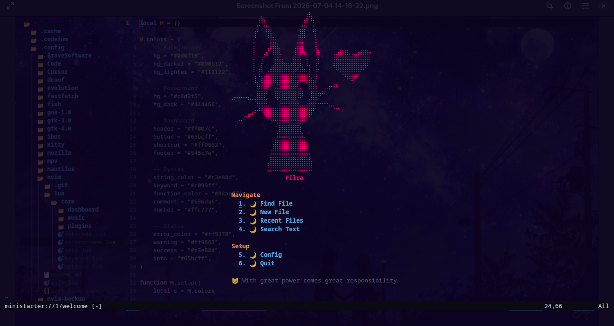
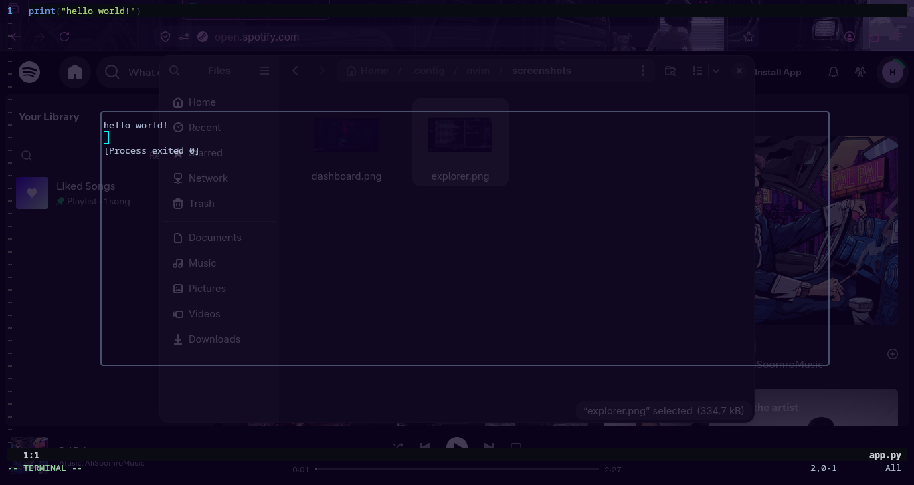
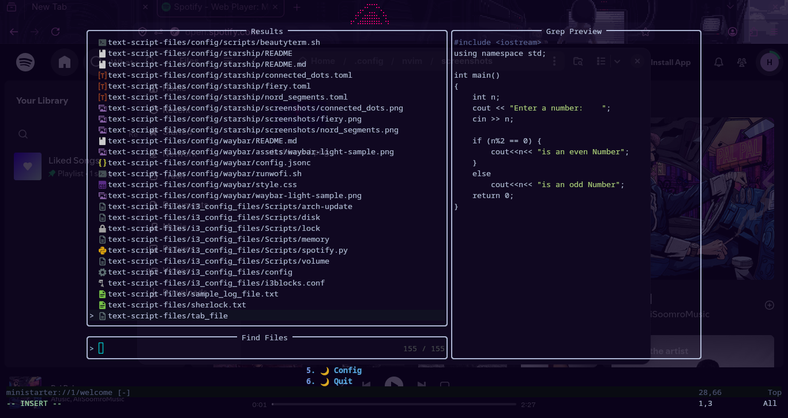

<p align="center">
  
  
  
  
  
  
</p>

<br>

<p align="center">
  
</p>

<h1 align="center">🐱 NekoNvim</h1>

<p align="center">
A beautiful, fast, modular and fully-featured Neovim configuration that transforms Neovim into a complete IDE.
</p>

<p align="center">
Built with ❤️ using Lua
</p>

---

# 📚 Table of Contents

- About
- Why NekoNvim?
- NekoNvim vs VS Code
- Screenshots
- Installation
- Features
- Keymaps
- Themes
- Customization
- Troubleshooting
- Performance
- Roadmap
- Contributing
- License

---

# ✨ About

NekoNvim is a modern Neovim configuration focused on **speed, simplicity and productivity**.

Instead of installing dozens of plugins manually, NekoNvim provides a polished development environment with everything already configured.

Designed for:

- 💻 Developers
- 🎓 Students
- 🐧 Linux users
- 📱 Termux users
- ☁️ Remote SSH workflows
- ⚡ People who love fast software

---

# ❓ Why NekoNvim?

Most Neovim configurations are either too minimal or overloaded with unnecessary plugins.

NekoNvim aims to provide the perfect balance.

## Highlights

- 🚀 Fast startup (~150ms)
- 🎨 Beautiful modern interface
- 🧩 Modular plugin structure
- 🌍 Cross-platform
- 📦 Easy installation
- 🎵 Built-in music player
- 🏃 Built-in code runner
- 🔥 Git integration
- 📂 File explorer
- 🔍 Telescope fuzzy finder
- ✂️ Snippets
- 🌐 HTML preview
- 🌈 Multiple themes
- 🪟 Transparent background
- ⚡ 33+ built-in features

---

# ⚔️ NekoNvim vs VS Code

| Feature | NekoNvim | VS Code |
|----------|----------|----------|
| Startup Time | ~150ms | 3–5 sec |
| RAM Usage | ~50MB | 500MB+ |
| CPU Usage | Very Low | High |
| Disk Space | ~20MB | 500MB+ |
| Keyboard Workflow | ✅ | ⚠️ |
| Mouse Required | ❌ | Usually |
| SSH Development | ✅ Native | Extension |
| Terminal Based | ✅ | ❌ |
| Git Integration | ✅ | ✅ |
| Customization | 100% Lua | JSON |
| Offline | ✅ | ✅ |
| Open Source | ✅ | ✅ |
| AI Support | 🚧 Coming Soon | Copilot |

---

# 🚀 Why Switch?

- Instant startup
- Extremely lightweight
- Keyboard-first workflow
- Native terminal experience
- Better SSH support
- Highly customizable
- Beginner friendly
- Fully open source
- No unnecessary bloat

---

# 📸 Screenshots

<p align="center">

</p>

<p align="center">



---

# 📦 Installation

## Requirements

| Package | Required |
|----------|----------|
| Neovim >= 0.9 | ✅ |
| Git | ✅ |
| Nerd Font | Recommended |
| ripgrep | Recommended |
| mpv | Important |
| yt-dlp | Important |

## Linux (Ubuntu/Debian)

```bash
sudo apt update

sudo apt install neovim git ripgrep python3 mpv yt-dlp

git clone https://github.com/HACK-LEGEND-HAMID/NekoNvim.git ~/.config/nvim

nvim
```

## Fedora

```bash
sudo dnf install neovim git ripgrep python3 mpv yt-dlp

git clone https://github.com/HACK-LEGEND-HAMID/NekoNvim.git ~/.config/nvim

nvim
```

## Arch Linux

```bash
sudo pacman -S neovim git ripgrep python mpv yt-dlp

git clone https://github.com/HACK-LEGEND-HAMID/NekoNvim.git ~/.config/nvim

nvim
```

## macOS

```bash
brew install neovim git ripgrep python3 mpv yt-dlp

git clone https://github.com/HACK-LEGEND-HAMID/NekoNvim.git ~/.config/nvim

nvim
```

## Termux

```bash
pkg update

pkg install neovim git ripgrep python mpv yt-dlp

git clone https://github.com/HACK-LEGEND-HAMID/NekoNvim.git ~/.config/nvim

nvim
```

## Windows

```powershell
winget install Neovim.Neovim Git.Git

git clone https://github.com/HACK-LEGEND-HAMID/NekoNvim.git $HOME\AppData\Local\nvim

nvim
```

---

# 🔒 Security Audit

NekoNvim has been analyzed using **Aikido Security Code Audit** to help identify potential security issues.

## Audit Summary

| Status | Result |
|--------|--------|
| Scan Status | ✅ Completed |
| Open Issues | ✅ 0 |
| Solved Issues | ✅ 1 |
| High Severity Issues | ✅ Fixed |

The reported issue was resolved and the latest audit shows **no remaining open security issues**.

## Audit Screenshots

<p align="center">
  
</p>

<p align="center">
  
  
</p>

> **Note**
>
> An earlier audit detected one **High Severity Remote Code Execution (RCE)** issue in `lua/core/autocmds.lua`.
> The issue has since been fixed, and the latest audit reports **0 open security issues**.


---

# 🎯 Features

NekoNvim includes over **33 built-in features** with sensible defaults and minimal configuration.

The following sections cover every feature in detail.

---

# 🖥️ Dashboard

A clean startup dashboard powered by **Mini.Starter** with random ASCII art that changes every time Neovim starts.

### Actions

| Button | Action |
|---------|--------|
| Find File | Telescope Find Files |
| New File | Create Empty Buffer |
| Recent Files | Telescope Oldfiles |
| Search Text | Telescope Live Grep |
| Config | Open Neovim Config |
| Quit | Exit Neovim |

---

# 🎨 User Interface

## Features

| Component | Description |
|-----------|-------------|
| Dashboard | Beautiful startup screen |
| Statusline | Cosmic styled statusline |
| Transparent Background | Modern terminal look |
| Icons | Nerd Font support |
| Notifications | Clean popup notifications |
| Themes | Multiple built-in color themes |

### Operating System Detection

```
 Linux
 Termux
 macOS
 Windows
```

---

# 📂 File Explorer

Powerful sidebar file explorer.

| Key | Action |
|-----|--------|
| Ctrl + f | Toggle Explorer |
| Enter | Open File |
| a | Create File |
| d | Delete |
| r | Rename |
| c | Copy |
| m | Move |

---

# 🔍 Telescope

Quickly search everything.

| Key | Action |
|-----|--------|
| Space ff | Find Files |
| Space fg | Live Grep |
| Space fb | Buffers |
| Space fh | Help Tags |
| Space fr | Recent Files |

---

# ✍️ Editing

Productive editing powered by modern Neovim plugins.

| Key | Action |
|-----|--------|
| ysiw" | Surround Word |
| cs"' | Change Quotes |
| ds" | Delete Surround |
| Space u | Undo Tree |
| s + 2 chars | Flash Jump |
| Space z | Zen Mode |

### Automatic Features

- Auto close brackets
- Smart indentation
- Auto pairs
- Better comments
- Better text objects

---

# 🏃 Code Runner

Run code without leaving Neovim.

Press:

```
Space + r
```

Supported languages include:

- Python
- Lua
- C
- C++
- Rust
- Go
- Java
- JavaScript
- TypeScript
- Ruby
- PHP
- Perl
- Bash
- Dart
- Kotlin
- Swift
- R
- Julia
- Scala
- Zig
- Nim
- Crystal
- Elixir
- Haskell
- Clojure
- Lisp
- HTML
- CSS

…and many more.

---

# ✂️ Snippets

Expand snippets instantly.

```
Ctrl + e
```

### Example Triggers

| Trigger | Language | Result |
|---------|----------|--------|
| ! | HTML | HTML Boilerplate |
| def | Python | Function Template |
| pr | Lua | print() |
| clg | JavaScript | console.log() |
| inc | C/C++ | Main Template |

---

# 🌐 HTML Preview

Preview HTML files directly in your browser.

Shortcut:

```
Space + shift + p
```

Features:

- Auto reload
- Live preview
- Fast startup

---

# 🎵 Music Player

Built-in terminal music player using **mpv** and **yt-dlp**.

| Key | Action |
|-----|--------|
| Space mp | Play |
| Space ms | Stop |
| Space mP | Pause |
| Space mr | Resume |
| Space my | Search YouTube |

Supports:

- Local music
- Direct URLs
- YouTube audio streams

---

# 🔧 Git Integration

Powered by Gitsigns.

### Shortcuts

| Key | Action |
|-----|--------|
| ]c | Next Hunk |
| [c | Previous Hunk |
| Space gb | Blame Line |
| Space gp | Preview Hunk |
| Space gr | Reset Hunk |

Git Signs

```
┃ Added

┃ Modified

_ Deleted
```

---

# ⚡ Automation

NekoNvim automatically:

- Removes trailing whitespace
- Restores cursor position
- Highlights copied text
- Auto resizes splits
- Detects filetype
- Smart indentation
- Auto reloads changed files
- Creates missing directories on save

---

# 🗂️ Project Structure

```text
~/.config/nvim/

├── init.lua
├── lazy-lock.json
└── lua/
    └── core/
        ├── init.lua
        ├── options.lua
        ├── keymaps.lua
        ├── autocmds.lua
        ├── colorscheme.lua
        ├── plugins/
        │   ├── init.lua
        │   ├── ui.lua
        │   ├── editor.lua
        │   ├── coding.lua
        │   ├── snippets.lua
        │   ├── git.lua
        │   ├── file_explorer.lua
        │   └── media.lua
        ├── dashboard/
        │   ├── init.lua
        │   └── art.lua
        └── music/
            ├── init.lua
            └── stream.lua
```

---

# ⌨️ Keymap Reference

## General

| Key | Action |
|------|--------|
| Space | Leader Key |
| Ctrl + s | Save File |
| Ctrl + q | Quit |
| Ctrl + h | Move Left Window |
| Ctrl + j | Move Down Window |
| Ctrl + k | Move Up Window |
| Ctrl + l | Move Right Window |

---

## File Operations

| Key | Action |
|------|--------|
| Ctrl + f | Toggle File Explorer |
| Space ff | Find Files |
| Space fg | Live Grep |
| Space fb | Buffers |
| Space fr | Recent Files |

---

## Coding

| Key | Action |
|------|--------|
| Space r | Run Current File |
| Space+shift+p | HTML Preview |
| Ctrl + e | Expand Snippet |
| Space u | Undo Tree |
| Space z | Zen Mode |

---

## Git

| Key | Action |
|------|--------|
| ]c | Next Hunk |
| [c | Previous Hunk |
| Space gb | Git Blame |
| Space gp | Preview Hunk |
| Space gr | Reset Hunk |

---

## Music

| Key | Action |
|------|--------|
| Space mp | Play Music |
| Space ms | Stop Music |
| Space mP | Pause |
| Space mr | Resume |
| Space my | YouTube Search |

---

# 🎨 Built-in Themes

| Theme | Style |
|--------|-------|
| Kitty Dark | Pink + Blue |
| Ocean | Cyan + Blue |
| Forest Night | Green + Blue |
| Neon Night | Pink + Green |

Switch themes easily by editing:

```lua
lua/core/colorscheme.lua
```

---

# ⚙️ Customization

## Change Dashboard ASCII Art

Edit:

```text
lua/core/dashboard/art.lua
```

Example:

```lua
M.arts = {
  {
    "  ╱|、",
    "(｡◕ ‿ ◕｡)",
    "  |、~〵",
  },
}
```

---

## Change Theme Colors

Edit:

```text
lua/core/colorscheme.lua
```

Example:

```lua
M.colors = {
    bg = "#0d0f18",
    header = "#ff007c",
    accent = "#00d4ff",
}
```

---

## Add a Language Runner

Edit:

```text
lua/core/plugins/coding.lua
```

Example:

```lua
filetype = {
    python = "python3 $fileName",
    lua = "lua $fileName",
    rust = "cargo run",
    your_language = "your_command $fileName",
}
```

---

# 🛠 Troubleshooting

| Problem | Solution |
|----------|----------|
| Plugins not installed | `:Lazy sync` |
| Dashboard not showing | `:Lazy reload mini.starter` |
| Icons appear as squares | Install a Nerd Font |
| Music won't play | Install `mpv` and `yt-dlp` |
| HTML Preview not working | Install your default browser |
| Telescope can't search | Install `ripgrep` |

---

# 📊 Performance

| Metric | Value |
|---------|-------|
| Startup Time | ~150ms |
| Plugins | ~20 |
| Features | 33+ |
| RAM Usage | ~50MB |
| Platforms | Linux, macOS, Windows, Termux |

---

# 🚀 Roadmap

## Completed

- [x] Dashboard
- [x] Telescope
- [x] Neo-tree
- [x] Git Integration
- [x] Snippets
- [x] HTML Preview
- [x] Music Player
- [x] Code Runner
- [x] Multiple Themes
- [x] Transparent Background
- [x] Zen Mode
- [x] Flash Navigation

## Planned

- [ ] AI Assistant
- [ ] Debug Adapter (DAP)
- [ ] Session Manager
- [ ] Package Manager UI
- [ ] Markdown Preview
- [ ] Better LSP Installer
- [ ] Plugin Marketplace

---

# 🤝 Contributing

Contributions are always welcome!

If you'd like to improve NekoNvim:

1. Fork the repository
2. Create a feature branch
3. Commit your changes
4. Push your branch
5. Open a Pull Request

Bug reports, feature requests and documentation improvements are appreciated.

---

# ❤️ Support

If you enjoy this project:

⭐ Star the repository

🍴 Fork it

📢 Share it with friends

---

# 📜 License

This project is licensed under the **MIT License**.

Feel free to use, modify and distribute it.

---

# 🙏 Credits

Special thanks to these amazing projects:

- Lazy.nvim
- Telescope.nvim
- Neo-tree.nvim
- Mini.Starter
- LuaSnip
- Gitsigns.nvim
- Flash.nvim
- Lualine.nvim
- nvim-autopairs
- Treesitter
- Which-Key.nvim

---

# 💖 Final Words

NekoNvim was built with one goal:

> **Make Neovim beautiful, fast and enjoyable without unnecessary complexity.**

Whether you're a beginner exploring Neovim or an experienced developer looking for a polished setup, NekoNvim aims to provide a productive and enjoyable coding experience.

---

<p align="center">

Made with ❤️ using Lua & Neovim

⭐ If you like this project, please consider giving it a Star!

Happy Coding 🚀

</p>
